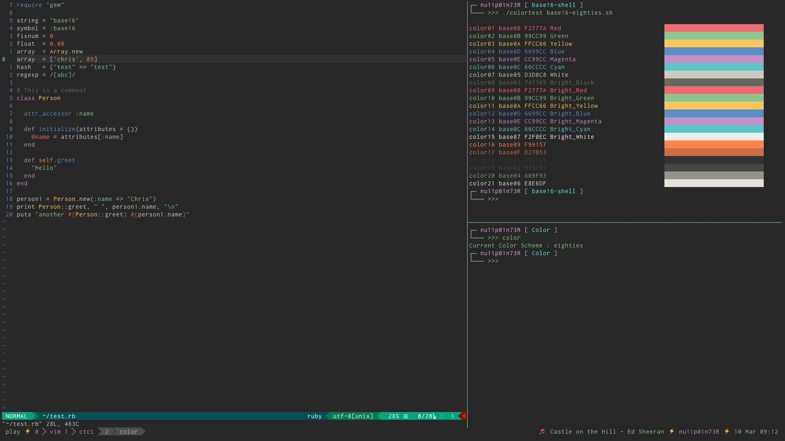

#Color

`color` is a simple utility which helps to change the base 16 terminal color schemes on the go.



#Requirements

The `color` is based on [Base16 shell project](https://github.com/chriskempson/base16-shell). 

Clone the project. Read installation steps from the github repo [here](https://github.com/chriskempson/base16-shell#installation). 

The `~/.bashrc` changes are not required for Base16 as `color` will take care of it.


#Installation

Clone the repo

```
$ git clone https://github.com/nu11p01n73R/Color ~/.Color
```

Add the following in your `.bashrc`

```
export BASE16_SHELL="~/.base16-shell/"
export COLOR_PATH="~/.Color/"
eval "$(bash $COLOR_PATH/color.sh)" && color reload
```


#Usage

All the available colors can be listed by using

```
$ color list
```

To change the color to a scheme use

```
$ color scheme_name
```

To reload the current scheme,

```
$ color reload
```

To demo all the available schemes for 2 sec interval, use

```
$ color demo
```

Just the `color` with no arguments will give you the current scheme and background.

#Vim color schemes

To change the vim color schemes as install (base16-vim)[https://github.com/chriskempson/base16-vim]
using your package manager.

Add the following in your `.vimrc`

```
if filereadable(expand("~/.vim_background"))
        let base16colorspace=256
        source ~/.vim_background
endif
```
